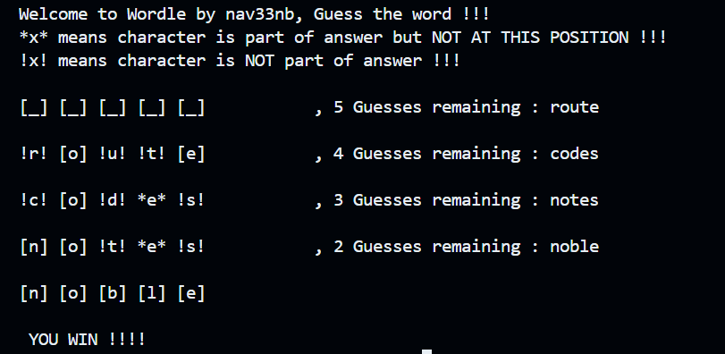

# Rather simple wordle implementation in C  

Wordle is a popular internet game where the objective is to guess a hidden 5-letter word with only 5 attempts. Players can only guess entire words and not specific letters in each round. After each guess, players receive hints based on the characters in their guessed word, usually shown with colors: green for correct letters in the correct positions, and yellow for correct letters in the wrong positions. 

As players guess more words, they gather information about the correct characters while discarding those not in the answer, eventually reaching towards the correct solution. In my program, for the sake of simplicity, I’ve opted to represent these hints with symbols: an exclamation mark (!) for a correct letter in the correct position and an asterisk (*) for a correct letter in the wrong position. This approach provides similar guidance as the original game, helping players work toward the correct answer.

